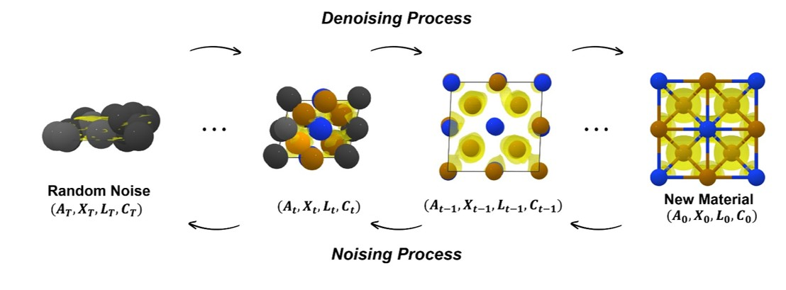
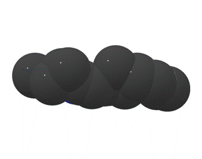

# ChargeDIFF

[[`Paper`](Tobeupdated)]
[[`Project Page`](Tobeupdated)]

Code release for the paper [`Electronic structure-aware generation of inorganic materials using generative models`](https://doi.org/10.1038/s41467-024-55390-9)

<p align="center">
  
</p>

ChargeDIFF is the first diffusion model for inorganic materials that explicitly considers electronic structure of materials. Moving beyond conventional structure-only representations (atom types, atomic coordinates, lattice), ChargeDIFF incorporates charge density as a additaional modality during the generation process. ChargeDIFF exhibited superior generation performance for bot h unconditional and conditional generation tasks, and ablation study attribute these gains to the model's deeper understanding on materials' electronic behavior. Please visit [Project Page](Tobeupdated) for more details.

<p align="center">
  
</p>

# Installation
We recommend to build a [`conda`](https://www.anaconda.com/products/distribution) environment as follow. You might need a different version of `cudatoolkit` depending on your GPU driver.
```
conda create -n chargediff python=3.10 -y && conda activate chargediff
conda install pytorch==2.0.0 torchvision==0.15.0 torchaudio==2.0.0 pytorch-cuda=11.7 -c pytorch -c nvidia
pip install torch_scatter torch_sparse -f https://data.pyg.org/whl/torch-2.0.0+cu117.html
pip install torch-geometric
pip install h5py joblib termcolor scipy einops tqdm matplotlib opencv-python PyMCubes imageio trimesh omegaconf tensorboard notebook Pillow==9.5.0 py3Dmol ipywidgets transformers pormake p_tqdm pyxtal matminer
conda install -y cudatoolkit=11.7 -c conda-forge
conda install -c fvcore -c iopath -c conda-forge fvcore iopath
conda install pytorch3d -c pytorch3d
pip install numpy=1.23.5
```

# Test ChargeDIFF

## Download the pretrained weight

First create a folder `./saved_ckpt` to save the pre-trained weights. Then download the pre-trained weights from the provided links and put them in the `./saved_ckpt` folder.
```
mkdir saved_ckpt  # skip if already exists

# VQVAE's checkpoint
wget -O saved_ckpt/vqvae.pth --user-agent="Mozilla/5.0" https://figshare.com/ndownloader/files/58917697

# ChargeDIFF's checkpoint
## Unconditional model
wget -O saved_ckpt/uncond.pth --user-agent="Mozilla/5.0" https://figshare.com/ndownloader/files/58917712

## Conditional models (bandgap, magnetic density, chemical system)
wget -O saved_ckpt/bandgap.pth --user-agent="Mozilla/5.0" https://figshare.com/ndownloader/files/58917700
wget -O saved_ckpt/magden.pth  --user-agent="Mozilla/5.0" https://figshare.com/ndownloader/files/58917709
wget -O saved_ckpt/chemsys.pth --user-agent="Mozilla/5.0" https://figshare.com/ndownloader/files/58917703
```

# Train ChargeDIFF

## Download the pretrained weight

First create a folder `./data` to download the Charge-MP-20 dataset.
```
mkdir data  # skip if already exists
wget -O saved_ckpt/MP-20-Charge --user-agent="Mozilla/5.0" https://figshare.com/ndownloader/files/58917712

```
